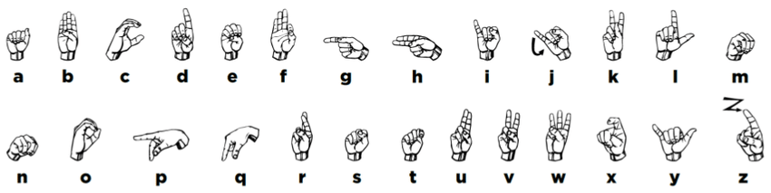
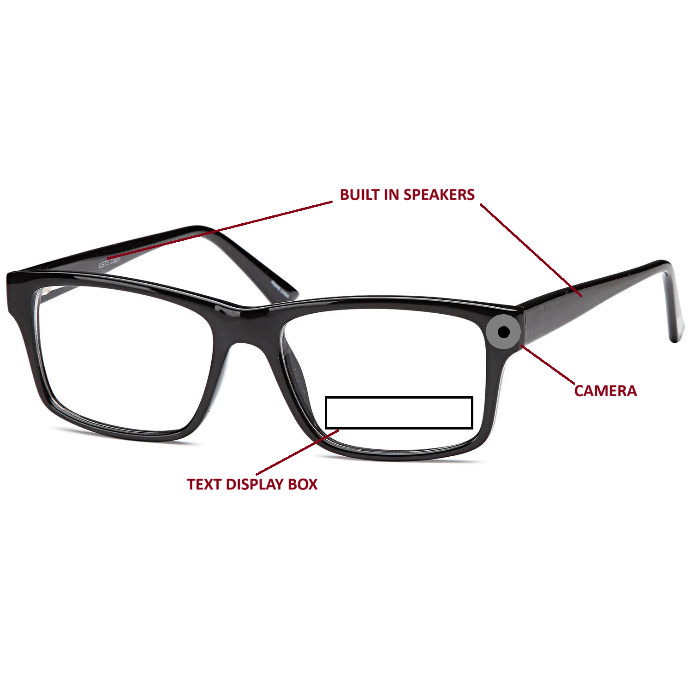
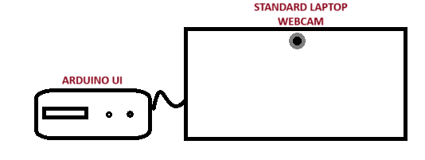
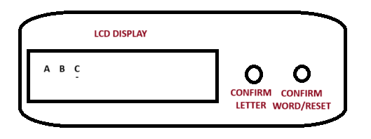

# ASL Smart Glasses: A Fiction on Real-Time Decoding of ASL Using Machine Learning

This project explores the concept of smart glasses that can decode American Sign Language (ASL) in real time using machine learning. It envisions a system where ASL signs are captured and translated instantly to enhance communication between deaf and hearing individuals.

The prototype features a Fingerspelling Decoder that uses a webcam and Arduino to display decoded ASL letters on an LCD screen. While the focus is currently on fingerspelling, the long-term goal is to expand this concept into a fully functional translation tool for ASL gestures.

# Key Features
- **Fingerspelling Decoder**: A working prototype using a webcam to capture ASL fingerspelling and decode it into text.
- **Arduino Integration**: Decoded letters are displayed on an Arduino-connected LCD screen, simulating a real-time translation process.
- **Visionary Design Fiction**: The project envisions a future where smart glasses could instantly decode and translate ASL signs into text or speech.
# Technologies Used
- **Machine Learning**: The system employs a trained model to predict ASL fingerspelling based on images captured by the webcam.
- **Python**: Used for image processing, machine learning, and running the fingerspelling decoder.
- **Arduino**: Used to simulate the display of decoded letters, showcasing how such a system could function in the future.
# Prototype
The working prototype captures ASL fingerspelling using a webcam, processes the image with a machine learning model, and displays the result on an Arduino-connected LCD screen. While it currently only handles fingerspelling, the goal is to extend it to include full ASL signs.

# Future Vision
While the current focus is on decoding fingerspelling, the ultimate vision for this project is to create a real-time translation tool for full ASL gestures. Future work will aim to improve the system’s accuracy, remove the need for manual input, and expand it to handle dynamic ASL signs.

# Contributors
Mostafa Shalaby, Ethan Welburn

